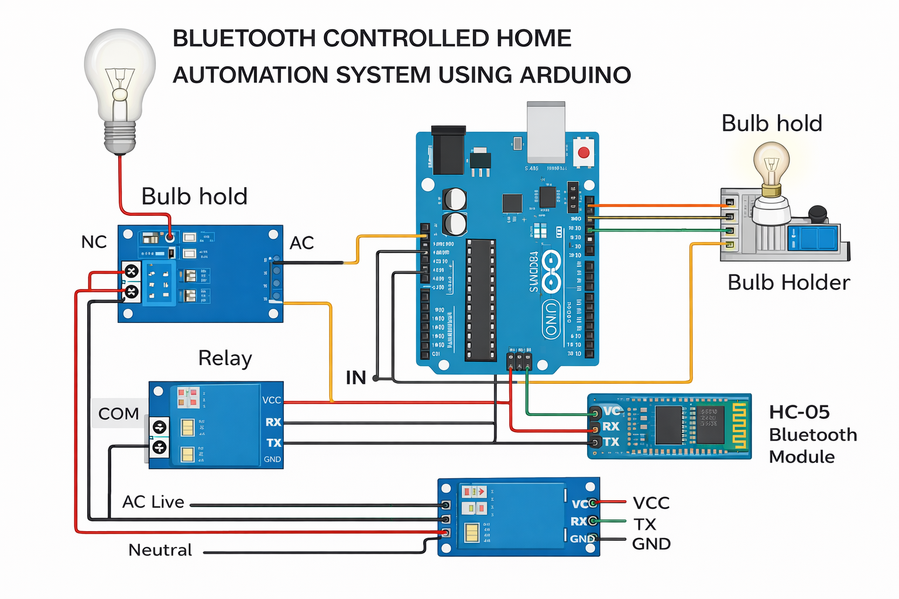
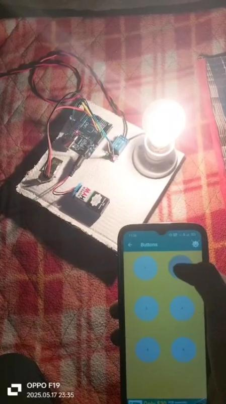

#  Home Automation System

## 🔹 Overview
This project is a Bluetooth-controlled smart home automation system using Arduino Uno and HC-05 module. It allows wireless control of electrical appliances through a smartphone.

## 🔹 Features
- Wireless ON/OFF control via smartphone  
- Real-time command execution  
- Safe relay switching for AC loads  
- Expandable for IoT integration  

## 🔹 Components
- Arduino Uno  
- HC-05 Bluetooth Module  
- Relay Module  
- Power Supply (9V)  

## 🔹 Circuit Connections
- HC-05 TX → Arduino RX  
- HC-05 RX → Arduino TX  
- Relay IN → Arduino Digital Pin  
- VCC → 5V  
- GND → GND  

## 🔹 Working Principle
The HC-05 Bluetooth module receives commands from a smartphone and sends them to the Arduino. The Arduino processes the input and controls the relay to switch appliances ON or OFF.

## ⚠️ Safety Note
This project involves AC mains voltage. Proper insulation and precautions must be taken while handling relay and AC connections.

## 🔹 Circuit Diagram

## 🔹 Project Model

## 🔹 Code
The Arduino code is available in: home_automation.ino

## 🔹 Project Report

## 🎥 Demo
[▶️ Watch Demo Video](https://www.linkedin.com/posts/kushwahapawan527_miniproject-smarthome-iot-activity-7341788645923733505-_J9z?utm_source=share&utm_medium=member_desktop&rcm=ACoAAFDvl2kB6PRtyj4xUWG4RrN098KB23CkRwY)

## 🔹 Future Improvements
- Mobile app development  
- IoT cloud integration  
- Voice control (Google Assistant / Alexa)  
